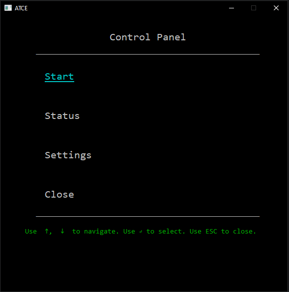
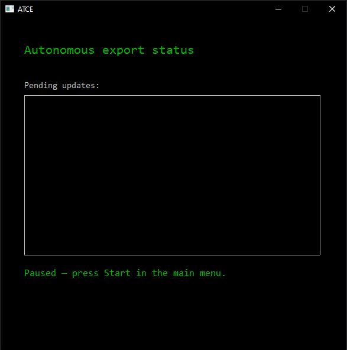
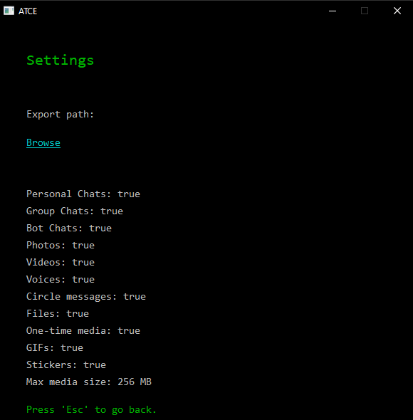
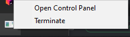

# ATCE - Autonomous Telegram Chat Exporter

A background Windows tray application that continuously mirrors your Telegram chats to
disk. It watches your account through [TDLib](https://core.telegram.org/tdlib) and, every
time a message arrives or gets edited, appends it to a per-chat JSON file and downloads
the attached media.

Unlike Telegram Desktop's built-in export — a one-shot dump you have to trigger by hand —
this runs unattended and keeps the archive up to date as your chats change.

## What it does

- **Watches for changes in real time.** New messages and message edits are picked up from
  TDLib's push updates, not by polling.
- **Writes incrementally.** A new message is appended to the chat's existing JSON file; the
  whole history is never re-downloaded.
- **Keeps edit history.** When a message is edited, the previous version is preserved —
  both inside the message (`edits`) and in a chat-wide chronological `edit_log`.
- **Downloads media.** Photos, videos, video notes (circles), voice messages, documents,
  GIFs, stickers and one-time (self-destructing) photos are saved next to the JSON.
- **Filters what to keep.** Chat types and every media type can be toggled individually,
  and media above a configurable size limit is skipped.
- **Stays out of the way.** No console, no window — just a tray icon, with a keyboard-driven
  control panel when you need it.

## Screenshots

|              |                   |
|------------------------------------------|----------------------------------------------|
| The control panel, opened from the tray  | Live view of the exporter's progress         |
|             |                |
| Export folder and per-media-type filters | The tray icon is the app's only permanent UI |

## Requirements

- Windows 10 or later
- CMake 3.21+
- A C++17 compiler (tested with MSVC)
- Git (used to fetch vcpkg and TDLib on the first build)
- Telegram `api_id` / `api_hash` from [my.telegram.org](https://my.telegram.org)

## Building

vcpkg and TDLib are fetched automatically on the first configure — nothing needs to be
installed beforehand.

```bash
cmake -B cmake-build-debug -S .
```

```bash
cmake --build cmake-build-debug
```

The first build compiles TDLib from source and takes a while; later builds are fast.

## Getting started

1. **Get your API credentials.** Sign in at [my.telegram.org](https://my.telegram.org) →
   *API development tools* → create an application. Note the `api_id` and `api_hash`.

2. **Put the executable somewhere writable.** It creates `config.json` and a `session/`
   folder next to itself, so pick a normal folder — `C:\Program Files` won't work without
   administrator rights.

3. **Run it.** A console window opens. It scrolls a lot of TDLib log output — that is
   normal, not an error. Answer the prompts as they appear:
   `api_id` → `api_hash` → phone number in international format (`+79991234567`) → the
   login code Telegram sends you → your two-factor password, if you have one.

4. **Wait for the console to close.** On success it prints a confirmation and closes itself
   after 5 seconds. If it is still open after ~10 seconds, just close it manually and start
   the program again — your login is already saved, so the second launch goes straight to
   the tray with no prompts.

5. **Choose where to export.** Right-click the tray icon → *Open Control Panel* →
   **Settings** → **Browse**, and pick a folder. Press `Esc` to go back.

6. **Press Start.** The exporter now archives every new and edited message. Set
   `"start_by_default": true` in `config.json` if you want it running from launch.

> Closing that console at any point terminates the whole application — which is exactly why
> it is safe to close if it gets stuck: nothing is left running in the background.

From then on, `config.json` and `session/` next to the executable keep your settings and
your login, so there is nothing to set up again.

## Usage

Right-click the tray icon for **Open Control Panel** and **Terminate**.

The control panel is keyboard-driven: `↑`/`↓` to move, `Enter` to select, `Esc` to go back
one scene (or to hide the panel from the main menu).

| Menu item | What it does |
|---|---|
| **Start** / **Stop** | Starts the exporter, or pauses it. While paused, incoming updates are discarded, not queued. |
| **Status** | Live view of pending updates and how many messages have been written. |
| **Settings** | Export folder and the filters below. |
| **Close** | Hides the panel. The app keeps running in the tray. |

Before starting, set an export folder in **Settings → Browse**. Without it the exporter
stays idle.

## Settings

| Setting | Default | Effect |
|---|---|---|
| Export path | — | Where chat files are written. Chosen through the standard folder picker. |
| Personal Chats | `true` | Export private and secret chats. |
| Group Chats | `true` | Export groups, supergroups and channels. |
| Photos | `true` | Export photo messages. |
| Videos | `true` | Export video messages. |
| Voices | `true` | Export voice messages. |
| Circle messages | `true` | Export video notes. |
| Files | `true` | Export documents. |
| One-time media | `true` | Export self-destructing photos and videos. Checked before Photos/Videos. |
| GIFs | `true` | Export animations. |
| Stickers | `true` | Export stickers. |
| Max media size | `256 MB` | Media larger than this is recorded but not downloaded. Cycles 256 → 512 → 1024 → 2048 → 4096. |

Changes are saved to `config.json` immediately. One option has no UI and must be edited
there by hand:

```json
"start_by_default": true
```

With it set, the exporter starts on launch without pressing **Start** — useful when running
the app from Windows startup.

## Output format

For each exported chat, in the export folder:

```
<chat_id>.json
<chat_id>_files/
    photo_12345.jpg
    video_67890.mp4
```

```json
{
  "chat_id": -1001234567890,
  "messages": [
    {
      "id": 8388608,
      "date": 1753800000,
      "sender_id": 123456789,
      "sender_type": "user",
      "text": "look at this",
      "media_type": "photo",
      "is_secret": false,
      "file_id": 42,
      "file_size": 184320,
      "downloaded": true,
      "file_path": "-1001234567890_files\\photo_12345.jpg"
    }
  ],
  "edit_log": []
}
```

`media_type` is `null` for plain text, otherwise one of `photo`, `video`, `video_note`,
`voice_note`, `document`, `animation`, `sticker`, or `other` for content we don't decode.
`downloaded` stays `false` when the file was skipped (over the size limit, filtered out, or
no longer available), and `file_path` is relative to the export folder.

An edited message gains an `edits` array holding each previous version, and the same records
are appended to the chat-level `edit_log` in the order the edits happened:

```json
{
  "edited_at": 1753800120,
  "message_id": 8388608,
  "previous_text": "look at this",
  "new_text": "look at this instead"
}
```

## How it works

Three threads share one TDLib client:

- **Auth thread** (`client::auth`) runs the login state machine once at startup, then exits.
- **Listen thread** (`client::listen`) is the *only* thread that calls `receive()`. Replies
  go to whoever is waiting for that request id; `updateNewMessage` and `updateMessageContent`
  are pushed onto a queue.
- **Worker thread** (`client::runAutonomousExport`) drains that queue: applies the filters,
  writes the JSON, downloads the media.

The split matters — anything that waits for a TDLib reply must not run on the listen thread,
since that thread is what delivers replies in the first place.

Media is downloaded synchronously into TDLib's own cache, then copied into the export folder
so the archive is self-contained. A large download blocks the worker, which is why the size
limit exists.

## Project layout

```
main.cpp                          thread setup and lifetime
platform/client/                  TDLib client, config, autonomous exporter
platform/windows/tray.*           tray icon and message loop
platform/windows/control_panel.*  panel window, input handling, painting
platform/windows/scenes/          scene model and Status refresh
platform/windows/ui/              Label / Button / Line primitives and the scenes
```

The UI is drawn directly with GDI — there are no child controls, so every widget is a
`Label`, `Button` or `Shape` that knows how to paint itself. Scenes live on a stack, which
is what `Esc` pops.

## Limitations

- Only the chats' *ongoing* changes are captured. Existing history is not exported — pause
  the exporter and nothing that happens meanwhile is recorded.
- Media the exporter is too slow to fetch (a one-time photo viewed before download finishes)
  is recorded as metadata only.
- When a self-destructing photo expires, TDLib reports it as expired content, which is
  currently stored as `media_type: "other"` and logged as an edit.
- `config.json` holds your `api_id`/`api_hash` in plain text. It is git-ignored, along with
  `session/`.

